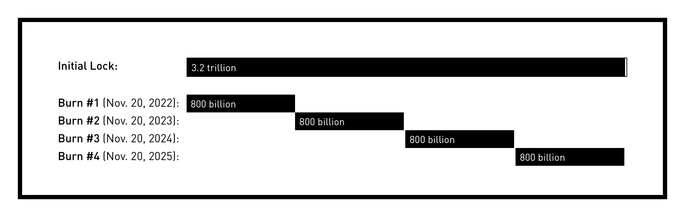
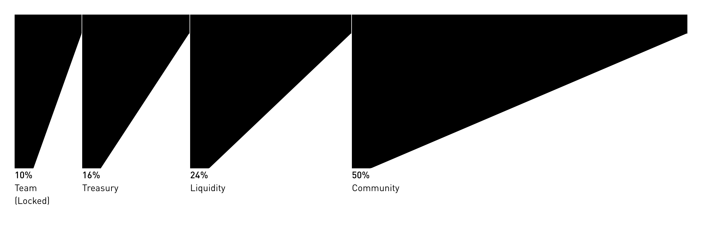
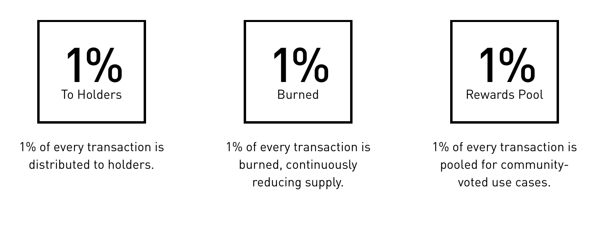

# Parts of Four Coin (P4C) Whitepaper

**Parts of Four Coin (P4C)** is an ERC-20 token deployed on the Ethereum blockchain and listed on Uniswap through an AMM mechanism. While its principal utility is to function as an upgrade token for Parts of Four NFTs, the grander vision is to bootstrap a community around jewelry as art.

The project has iterated rapidly since its inception and this “super-lite” paper serves to outline its current state, future goals, and the means to reaching that goal.

## A Brief History of P4C

- The P4C community token was conceived initially as a foray into the space by [Parts of Four](https://partsof4.com), a jewelry brand. It was launched as a Uniswap liquidity pool and the remaining tokens were locked into a Unicrypt vault.

- Soon after, a decision was made to pivot from a profit-driven and business oriented token to a community oriented token.

- 3.2 trillion tokens, initially planned to be released over time, are now scheduled to be burnt on an annual basis. The total supply of tokens is now capped at 12.6 billion and will only deflate as we implement various mechanisms in the tokenomics and the NFT economic design space.

- Massive burn events have already taken place and will continue.
  

- The token distribution is as follows: 10% for the team, 15% for the system treasure to fund development ideas and bootstrap engagement, 25% liquidity, and 50% community.

  

## Team Members

## Tokenomics
We believe tokenomics should be about system holistic design and not about the quantity of tokens or token distribution. We believe in using the token to incentivise value storage and value creation, as well as to attract a broader user base into the ecosystem. The token is being used as follows.

- **Deflationary Reflections**. P4C is programmed to redistribute to holders, decrease supply, and create reward pools by applying a 3% tax to all transactions. The tax will be distributed in the following manner:
  - 1% of every transaction is distributed to holders.
  - 1% of every transaction is burned, continuously reducing supply.
  - 1% of every transaction is pooled for community-voted use cases.

    

- **Rarity Burning**.

- **Token Buybacks and Burns**. Our goal is to use NFT sales to drive value into the token, and a simple and direct method to do this is to buyback and burn tokens at a prescribed rate. Currently, our intention is to use 3% of NFT sales to buy back P4C tokens and burn them.

## Links
- [Parts of Four Coin page](https://partsof4.com/pages/p4c)
- [Parts of Four NFT page](https://partsof4)
- [Telegram](https://t.me/partsof4)
